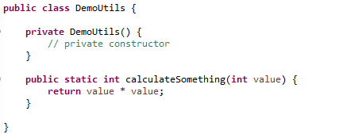
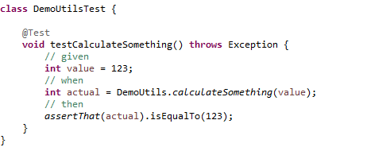

# JUnit Tools for Spring
[Update Site URL](https://csorbazoli.github.io/junit-tools-updatesite/)

## Aim of this project
Create a tool for helping the developers to write simple and maintainable unit tests with minimal effort on the tedious part and let them focus on the important part of the tests.

This plugin promotes the "Test First" approach. Create a well structured test method skeleton from the method signature with
* given-when-then blocks (Gherkin style)
** given: pre-initialized parameter values
** when: method is called
** then: assert for return value

Additional features:
* using mockito runner for fast test execution
* mock dependencies of the tested class
* using *TestValueFactory* for effortless but consistent input value creation, see samples below
* using JSON comparison for checking complex result types instead of endless asserts on each single field value
* customization through preferences

Spring support:
* use Spring testing annotations if that is preferred or needed
* enhanced rest endpoint testing with MockMvc

## Samples

You can find the samples below on [GitHub](https://github.com/csorbazoli/junit-tools/tree/master/junit-tools-demo).
Feel free to clone this repository and play around with the test generation functionality of the plug-in.

### Testing static methods

| Base class  | Test class |
| ------------- | ------------- |
|   |   |

### Testing a method with simple input parameters

### Testing a method with a simple return value

### Testing a method without return value

### Testing a method with complex input parameters
One of the most tedious part of writing a unit test is the preparation of input parameters when mocking is not sufficient.
Mocking an input parameter is only useful when you have an interface or a class that is not a Java Bean (i.e. a service or function).

On the other hand, when you need to deal with data then you need to prepare that item with all it's fields that are relevant for that method.
This can require a big effort and lot of extra work.

Using *TestValueFactory* is a nice workaround for this problem. It prefills all fields of given data object (e.g. Java Bean) with consistent and predictable values.
So you can rely on that the input data is always the same and you only need to take care of the fields that are special related to that function. For example
* fields that should be empty/null
* text fields with some special formatting expectation (e.g. date/time values)

But in most of the cases it's enough to have the default values generated by the factory.

If the input parameter is not a primitive value, then the generator assumes that the TestValueFactory should be used instead and generates to code accordingly (see below).

### Testing a method with complex return value
When the tested method is producing a complex data structure in the response, then it can be tedious to test all of details of that object.
Either you're expecting that only a handful of properties were changing as a "side-effect" of the method execution, 
or all of the fields are important because it the method is creating a new object based upon the input parameters (e.g. a converter from an entity to a DTO).

In my opinion, this makes the test maintenance way easier and this way the test can detect (and protect from) accidental changes resulting from changes in the data model.
It may sound controversial, but actually this can help a lot.

For example, the data model is changing in the application and the developer would forgot that this change
affects a certain service or converter that is consuming or producing the changed element.
The test would show automatically that the output is different from the previously known and expected form.
This at least raises the important question: does this class need to be changed also in order to handle the new field, or the field removed is still needed, etc.
The answer might be "yes it's okay", then update the JSON file in the test-resources folder and done.
But in several cases the answer is "oops, I forgot about that this needs to be handled here as well".

Also note, that the usual testing that is focusing only on the known fields would not detect this problem.

The same solution can be used to check if a dependent service was triggered with the right object.
For example, if the method supposed to save an entity to the database with specific field values, then use the following pattern.

```java
	ArgumentCaptor<SomeEntity> entityCaptor = ArgumentCaptor.forClass(SomeEntity.class);
	verify(someRepo).save(entityCaptor.capture());
	assertThat(TestUtils.objectToJson(entityCaptor.getValue()))
		.isEqualTo(TestUtils.readTestFile("dbtestfiles/SomeEntity_saved.json"));
```

### Testing Spring related classes
Spring tests are slightly different than the usual barebone or mocked test classes.
These tests are instantiating a Spring context when they are running with it's pros and cons.
Advantages:
* it's more comprehensive and reliable for testing Spring feature (e.g. caching)
* it can use the environment configuration properties (i.e. entries from application.yml)
* easier to write integrated tests (i.e. injecting an actual dependency)

Disadvantages:
* the overhead of initializing the Spring context can make the test execution slower
* bit more tedious to write the test (more annotations and settings)

Formal differences:
* using different annotations for the test elements (e.g. @Autowired instead of @InjectMocks, @MockBean instead of @Mmock) 

Good practices:
* Use simple mocking instead if no Spring specific functionality is tested
* Minimize the Spring context to the bare minimum
** Mainly for the tested class only instead of building up the full application
** Avoid initializing the database engine, unless you specifically want to test that
* Use Spring test for the following areas
** Caching (e.g. @Cacheable, @EvictCache), that is especially useful to make sure the cache configuration works properly as it's easy to misconfigure/break
** (REST) Controller endpoints (e.g. @GetMapping, @PostMapping), where easy to misconfigure the parameters, default values, headings, etc.
** Database, in case you are writing custom database handling methods instead of generated ones

#### Example: Testing a Spring service

#### Example: Testing a Spring controller with different endpoints


# Release notes

## v1.2.3 sample test util
* sample test util implementation updates

## V1.2.2 rest controllers
* improved rest controller testing

## V1.2.1 enhanced test methods
* Boolean return value with assert isTrue
* Fixed static method test

## V1.2.0 basic functionality
* Generate test class  with Mockito (or EasyMock) Runner and Mock
* Generate test class with SpringRunner and MockBean
* Generate test methods for static methods
* Generate test method body with parameter initialization and isEqualTo assertion
